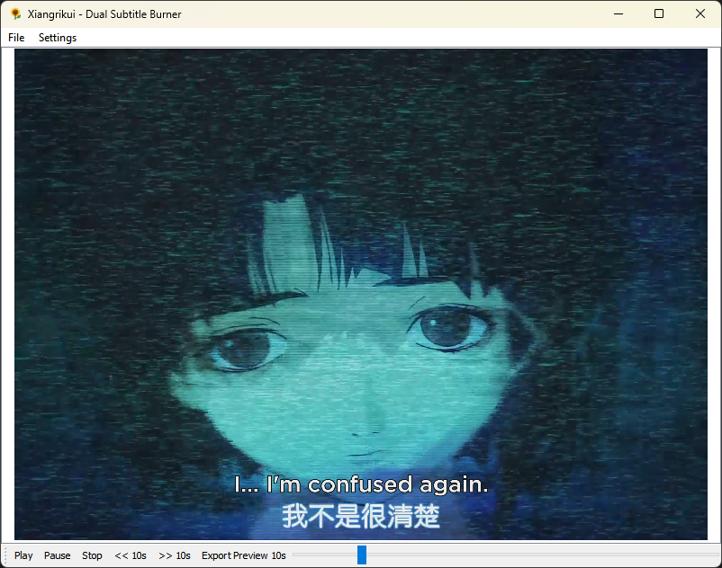

<div align="center">
  
</div>

<h1 align="center">Xiangrikui - Dual Subtitle Burner</h1>

<div align="center">
  Xiangrikui - Dual Subtitle Burner is a Python-based GUI application designed for personal use to play videos with two simultaneous subtitles and export them with burned-in subtitles. It is primarily focused on burning dual subtitles in Chinese and English, but can be used to burn dual subtitles in any language. The program allows customization of subtitle styles, positions, and presets for different video types.

This tool is built for personal video editing needs, such as adding bilingual subtitles to educational or entertainment content.

⚠️ **NOTE**: This application is currently in BETA version (v0.1). Although the main functionality is stable, there may be some issues or limitations.
</div>
<br>
<div align="center">
  
</div>


## Features

- Play videos with two overlapping subtitles in real-time.
- Customize subtitle fonts, colors, sizes, positions, outlines, and margins.
- Presets for subtitle positions:
  - None (both subtitles, default margins).
  - Chinese video (only Subtitle 2, adjusted margin).
  - English video (only Subtitle 1, adjusted margin).
  - No subtitles (only Subtitle 2, adjusted margin, useful in case you want to burn just one subtitle).
- Export full video or 10-second previews with burned-in subtitles using FFmpeg (supports hardware acceleration if available).
- Preview export from current playback position.
- Error handling for codec issues and missing dependencies.

## Installation

1. Install Python (version 3.8 or higher recommended).
2. Install the necessary libraries via pip:
   ```
   pip install pyqt5 pysubs2
   ```
3. Install FFmpeg manually (required for exporting videos with burned-in subtitles):
   - On Windows: Download from https://ffmpeg.org/download.html and add to PATH.
   - On macOS: `brew install ffmpeg` (if using Homebrew).
   - On Linux: `sudo apt install ffmpeg` (on Ubuntu/Debian) or equivalent.
   Note: Ensure FFmpeg is in the system PATH so subprocess can find it.
4. Additional (for Windows): If you experience errors playing videos (like 0x80040266), install LAV Filters from https://github.com/Nevcairiel/LAVFilters/releases for codec support.

## Usage

1. Run the program:
   ```
   python main.py
   ```
   Or use the compiled .exe if available.

2. Load a video file via "File > Load Video".
3. Load subtitles via "File > Load Subtitle 1" and/or "Load Subtitle 2".
4. Configure styles and positions via "Settings > Configure Subtitle 1/2" or presets in "Settings > Position Presets".
5. Play the video to preview subtitles.
6. Export the full video via "File > Export Video with Subtitles" or a 10-second preview via the toolbar button "Export Preview 10s".

## Notes

- This program is intended for personal use only.
- FFmpeg must be installed and accessible for export functionality.
- The application supports any language subtitles but is optimized for dual Chinese-English setups.

## License

This project is for personal use and not licensed for commercial distribution. Feel free to modify for your own needs.